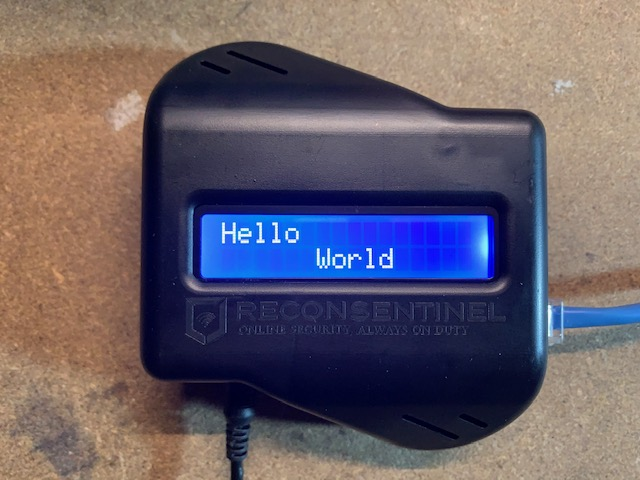

# Recon Sentinel Hacking

Misc. experiments with what is being sold as a $15 dev kit, but in fact is a recycled product called the [Recon Sentinel](https://www.reconsentinel.com).



Right now most of the information can be found in the [journal](./journal.md).  As things move along I'll work on adding more to this file.


## Setup

Armbian comes with python3, but not all the dependencies these scripts require.  You could install these directly, but it's safer to use a venv instead.

From the directory you cloned this repository into...

```
sudo apt install python3-pip
sudo apt install python3-venv
sudo apt install python3-dev

python3 -m venv /path/to/your/venvs/recon-sentinel-hacking
source /path/to/your/venvs/recon-sentinel-hacking/bin/activate

pip install wheel
pip install -r requirements.txt
```

By default normal users are not granted access to the i2c device files used to communicate with the LCD, therefore `sudo` is required to run these scripts.  This is complicated slightly by the virtual environment setup, so the command to run the [hello-lcd.py](./hello-lcd.py) script looks like this:

`sudo /path/to/your/venvs/recon-sentinel-hacking/bin/python ./hello-lcd.py`


## Hardware

### LCD Connections

| Wire | ROCK64 Pin | LCD Module Pin |
|------|------------|----------------|
| red | 2/5v | VCC |
| grey | 6/gnd | GND
| brown | 28/GPIO2_A5/I2C1_SCL | SCL |
| blue | 27/GPIO2_A4/I2C1_SDA | SDA |


## References

* http://files.pine64.org/doc/rock64/ROCK64_Pi-2%20_and_Pi_P5+_Bus.pdf
* https://www.armbian.com/rock64/
* https://forum.pine64.org/showthread.php?tid=5902
* https://shiroku.net/robotics/using-i2c-lcd-on-raspberry-pi/
